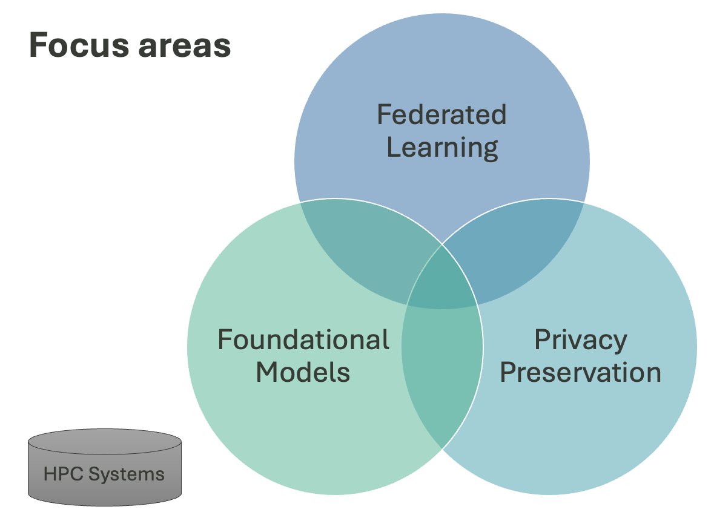

# Privacy-Preserving Federated Learning for Science: Building Sustainable and Trustworthy Foundation Models

This repository is part of a U.S. Department of Energy (DOE) Advanced Scientific Computing Research (ASCR) project focused on developing privacy-preserving federated learning approaches for scientific foundation models. The project aims to advance secure, trustworthy, and sustainable machine learning methodologies for large-scale scientific applications. 

ORNL Principal Investigator: Olivera Kotevska, PhD.

**Project Duration:** 2024-2027

---

# Focus Areas

The project sits at the intersection of **federated learning**, **foundational models**, and **privacy preservation**, with all three grounded in **HPC systems**.

  

---

# Awards

**PRESTO: Privacy Recommendation and Security Optimization** - R&D 100 Award Winner 2025  
PRESTO is an innovative framework designed to provide privacy recommendations and security optimization for machine learning systems. This recognition highlights the project's significant contribution to advancing privacy-preserving technologies in scientific computing.  
[Learn more about PRESTO](https://www.rdworldonline.com/rd-100-2025-winner/presto-privacy-recommendation-and-security-optimization/)

---

# Community

We are building a community around trustworthy, privacy-preserving federated learning for science, spanning secure model aggregation, data confidentiality, system scalability, and integration with research infrastructure.

**Trustworthy Privacy-Preserved Federated Learning for Science** — a Birds-of-a-Feather session at the Trillion Parameter Consortium meeting (TPC26), held June 2, 2026 in Baltimore, Maryland, and organized with Argonne National Laboratory. The conversation continues beyond the session; researchers and practitioners working on federated learning across institutional boundaries are welcome to join.

[Visit the community site](https://ornl.github.io/RealWorld_FL/)

---

# Publications

## Under review

1. **Automated Membership Inference Attacks (MIA): Discovering MIA Signal Computations using Large Language Model (LLM) Agents**  
   [Link](https://arxiv.org/pdf/2603.19375)

2. **SelfGrader: Stable Jailbreak Detection for Large Language Models using Token-Level Logits**  
   [Link](https://arxiv.org/pdf/2604.01473)

## Accepted

1. **IntraShuffler: A Privacy Preserving Framework for Heterogeneous DP Federated Learning**  
   *40th Annual IFIP WG 11.3 Conference on Data and Applications Security and Privacy (DBSec 2026)*

2. **XMark: Reliable Multi-Bit Watermarking for LLM-Generated Texts**  
   *The 64th Annual Meeting of the Association for Computational Linguistics*  
   [Link](https://arxiv.org/pdf/2604.05242) | [Code](https://github.com/JiiahaoXU/XMark)

3. **Traceable Black-box Watermarks for Federated Learning**  
   *The Fourteenth International Conference on Learning Representations (ICLR) 2026*   
   [Link](https://arxiv.org/pdf/2505.13651) | [Code](https://github.com/JiiahaoXU/TraMark)

4. **Energy-Efficiency Metrics for Privacy-Preserving Federated Learning with SmartNIC Server Acceleration**  
   *The Sixteenth International Workshop on Accelerators and Hybrid Emerging Systems co-located with 40th IEEE International Parallel and Distributed Processing Symposium*

## Published

1. **Scalable Federated Learning for Scientific Foundation Models on Leadership-Class Systems**  
   *The 6th Workshop on Machine Learning and Systems (EuroMLSys) co-located with EuroSys '26*  
   [Link](https://dl.acm.org/doi/abs/10.1145/3805621.3807639)

2. **Selective Amnesia using Contrastive Subnet Erasure for Class Level Unlearning in Vision Models**  
   *The IEEE/CVF Conference on Computer Vision and Pattern Recognition (CVPR) 2026*  
   [Link](https://openaccess.thecvf.com/content/CVPR2026/html/Pramanik_Selective_Amnesia_using_Contrastive_Subnet_Erasure_for_Class_Level_Unlearning_CVPR_2026_paper.html) | [Code](https://github.com/VishalPramanik/CSE)

3. **DP-TwoLevel: Two-Stage Gradient Subspace Learning for Differentially Private Federated Learning**  
   *SPIE Conference on Assurance and Security for AI-enabled Systems 2026*  
   [Link](https://www.spiedigitallibrary.org/conference-proceedings-of-spie/14046/140460E/DP-TwoLevel--two-stage-gradient-subspace-learning-for-differentially/10.1117/12.3094636.short)

4. **Entropy-weighted Multi-layer Attention for Token-level Attribution in Autoregressive Language Models**  
   *SPIE Conference on Assurance and Security for AI-enabled Systems 2026*  
   [Link](https://www.spiedigitallibrary.org/conference-proceedings-of-spie/14046/140461A/Entropyweighted-multilayer-attention-for-tokenlevel-attribution-in-autoregressive-language-models/10.1117/12.3094733.short)

5. **Engineering Privacy at the Edge: A Practical Guide to Differential Privacy in System Architectures**  
   *The 43rd IEEE International Conference on Computer Design (ICCD 2025)*   
   [Link](https://ieeexplore.ieee.org/stamp/stamp.jsp?arnumber=11311065) | [Code](https://github.com/ORNL/PETINA)

6. **Privacy-Preserving Federated Learning for Science: Challenges and Research Directions**  
   *The 13th IEEE International Conference on Big Data (IEEE BigData 2025)*   
   [Link](https://ieeexplore.ieee.org/stamp/stamp.jsp?arnumber=10825853)

7. **Balancing Trade-offs: Adaptive Differential Privacy in Interpretable Machine Learning Models**  
   *22nd Annual International Conference on Privacy, Security, and Trust (PST2025)*   
   [Link](https://ieeexplore.ieee.org/abstract/document/11268818)

8. **Optimal Client Sampling in Federated Learning with Client-level Heterogeneous Differential Privacy**  
   *IEEE Internet of Things Journal*   
   [Link](https://ieeexplore.ieee.org/abstract/document/11373392) | [Code](https://github.com/JiiahaoXU/GDPFed)

9. **MIC-DP: A Scalable Correlation-Aware Differential Privacy Framework for High-Dimensional Data**  
   *IEEE Transactions on Privacy Journal*   
   [Link](https://ieeexplore.ieee.org/abstract/document/11218270) | [Code](https://github.com/aeris-lab/mic-dp)

10. **Privacy Preservation from High-Performance Computing to Autonomous Science [Industrial and Governmental Activities]**  
    *IEEE Computational Intelligence Magazine*   
    [Link](https://ieeexplore.ieee.org/abstract/document/11079249)

11. **OmniFed: A Modular Framework for Configurable Federated Learning from Edge to HPC**  
    *2025 International Conference for High Performance Computing, Networking, Storage and Analysis (SC'25), ExHedtAI: The Workshop on Extreme Heterogeneity and AI Convergence in HPC*  
    [Link](https://dl.acm.org/doi/pdf/10.1145/3731599.3767397) | [Code](https://github.com/at-aaims/OmniFed)
